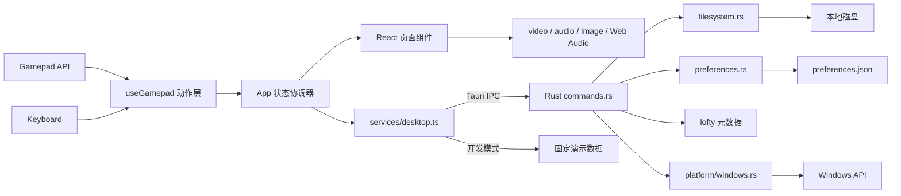
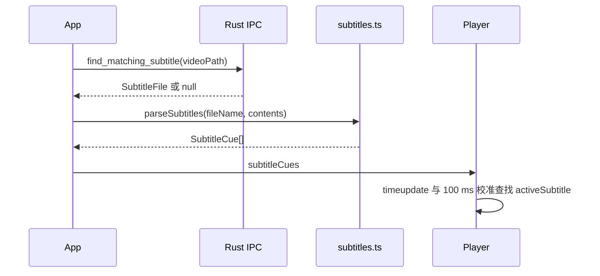

# CouchAxis 技术架构与实现路径

> 文档版本：0.1.0-current
> 最后核对：2026-07-24
> 本文同时描述“当前代码已经实现的方案”和“迁移到 libmpv / SDL2 的目标方案”。未完成项会明确标记为规划。

## 1. 技术目标

CouchAxis 的技术设计围绕以下约束展开：

1. Windows 10 / 11 优先交付。
2. 本地独立运行，不依赖服务器。
3. 手柄可以完成主要操作。
4. 直接浏览文件系统，不建立媒体数据库。
5. UI、动作语义和媒体业务逻辑尽量跨平台复用。
6. 文件系统根目录、窗口全屏和系统权限集中在平台边界。
7. 在不阻塞 UI 的前提下处理目录扫描、元数据和文件读写。

## 2. 当前技术栈

| 层 | 当前实现 | 作用 |
| --- | --- | --- |
| 桌面容器 | Tauri 2 | 窗口、IPC、应用目录、打包、资源协议 |
| 系统核心 | Rust 2021 | 文件系统、偏好、字幕读取、音频元数据、截图落盘 |
| UI | React 19 + TypeScript | 页面状态、媒体控制、手柄动作分发、国际化 |
| 构建 | Vite 8 + pnpm | 开发服务器、类型检查、前端产物 |
| 视频/音频 | HTMLMediaElement + WebView2 | 当前媒体解码与播放 |
| 频谱 | Web Audio API | 音频频率分析和 Canvas 绘制 |
| 手柄 | Navigator Gamepad API | 当前轮询、布局识别和动作映射 |
| 元数据 | lofty 0.24 | 标题、艺术家、专辑、歌词和内置封面 |
| Windows 磁盘 | windows-sys | `GetLogicalDrives`、`GetDriveTypeW` |
| 测试 | Vitest + Rust unit tests | 纯逻辑和 Rust 核心回归 |

目标技术栈中的 libmpv 和 SDL2 尚未接入。当前架构保留了迁移所需的动作层、组件句柄和平台适配边界，但不能把当前播放器描述为 libmpv 实现。

## 3. 总体架构



### 3.1 边界原则

- React 不直接调用 `std::fs` 或 Windows API。
- Rust 不保存页面焦点、选中行或弹窗状态。
- 前端只通过 `services/desktop.ts` 访问桌面能力。
- `services/desktop.ts` 同时提供桌面 IPC 实现和浏览器演示实现。
- 手柄先转换为稳定的 `AppAction`，页面再解释动作含义。
- 视频、音乐和图片组件通过 `forwardRef` 暴露命令式控制接口，`App.tsx` 不直接操作 DOM 媒体元素。

## 4. 目录结构

```text
CouchAxis/
├─ docs/
│  ├─ FUNCTIONAL_OVERVIEW.md       功能与操作说明
│  └─ TECHNICAL_IMPLEMENTATION.md  本文
├─ src/
│  ├─ App.tsx                      全局状态与动作路由
│  ├─ types.ts                     前端数据契约与 AppAction
│  ├─ i18n.tsx                     中英文文案与上下文
│  ├─ styles.css                   全局布局和媒体页面样式
│  ├─ components/
│  │  ├─ Player.tsx                视频播放、字幕、截图、专注模式
│  │  ├─ AudioPlayer.tsx           音乐、队列、歌词、频谱、黑屏
│  │  ├─ ImageViewer.tsx           图片视口、缩放、漫画、专注模式
│  │  ├─ SubtitlePicker.tsx        应用内字幕选择器
│  │  ├─ FolderPicker.tsx          截图目录选择器
│  │  ├─ SettingsPanel.tsx         设置页面
│  │  └─ ControllerHelpOverlay.tsx 页面级手柄说明
│  ├─ hooks/
│  │  ├─ useGamepad.ts             Gamepad 轮询、组合键、连发
│  │  └─ useKeyboard.ts            键盘后备映射
│  ├─ lib/
│  │  ├─ subtitles.ts              SRT/ASS/SSA 解析
│  │  ├─ lyrics.ts                 内置歌词与当前行计算
│  │  ├─ screenshots.ts            视频帧合成和 PNG 编码
│  │  ├─ playbackRate.ts           倍速阶梯
│  │  ├─ imageViewport.ts          图片适应、缩放和平移边界
│  │  └─ controllerHelp.ts         页面级动作说明数据
│  └─ services/desktop.ts          桌面/浏览器双实现适配层
└─ src-tauri/
   ├─ tauri.conf.json              窗口、资源协议和打包配置
   ├─ capabilities/default.json    Tauri 权限
   └─ src/
      ├─ lib.rs                    Tauri 启动和命令注册
      ├─ commands.rs               IPC 命令、元数据、字幕、截图
      ├─ filesystem.rs             媒体过滤和目录扫描
      ├─ preferences.rs            JSON 偏好持久化
      ├─ models.rs                 Rust/TypeScript 对应数据模型
      ├─ error.rs                  稳定错误码和消息
      └─ platform/                 Windows/Unix 根目录适配
```

## 5. 前端状态与职责

### 5.1 `App.tsx`

`App.tsx` 是当前应用的状态协调器，负责：

- 启动时并行加载磁盘、上次路径和偏好。
- 维护磁盘区、文件区、设置页和各选择器的选中位置。
- 发起目录浏览并处理加载、错误和竞态。
- 返回父目录时将子目录路径作为首选条目传入浏览请求，结果加载后按不区分大小写的路径匹配恢复选择。
- 在偏好中维护文件列表/网格模式，工具栏与手柄动作共用同一更新入口。
- 根据文件类型打开视频、音乐或图片页面。
- 构建音乐队列和切歌策略。
- 自动查找与手动切换字幕。
- 将 `AppAction` 路由到当前页面组件。
- 在页面切换时选择正确的手柄帮助上下文。
- 对设置变更做 120 毫秒防抖保存。

当前状态集中在单个组件中，便于早期快速迭代。继续扩展时建议把以下领域拆成 hooks 或 reducer：

- `useBrowserState`
- `usePreferences`
- `useSubtitleSession`
- `useAudioQueue`
- `useMediaActionRouter`

拆分条件应是状态关系已稳定且测试能够覆盖，不建议只为减少文件行数提前抽象。

### 5.2 媒体组件句柄

媒体组件使用 `forwardRef` 和 `useImperativeHandle` 暴露页面动作：

| 组件 | 主要句柄 |
| --- | --- |
| `Player` | 播放暂停、跳转、音量、静音、字幕、倍速、截图、全屏、专注模式 |
| `AudioPlayer` | 播放暂停、跳转、音量、重播、队列、频谱、黑屏、全屏 |
| `ImageViewer` | 缩放、持续缩放、停止缩放、平移、切图、旋转、重置、比例锁定、全屏、专注模式 |

好处是输入动作和组件内部 DOM 状态解耦。未来替换媒体后端时，`App.tsx` 的大部分动作语义可以保留。

## 6. 桌面适配层

`src/services/desktop.ts` 是前端唯一桌面入口。

### 6.1 桌面模式

检测到 `window.__TAURI_INTERNALS__` 后：

- 使用 `invoke` 调用 Rust 命令。
- 使用 `convertFileSrc` 把本地媒体路径转换为 Tauri asset URL。
- 使用 Tauri Window API 查询和设置原生全屏。

### 6.2 浏览器开发模式

普通 `pnpm dev` 不访问真实磁盘：

- 返回固定的 C/D/E 演示磁盘。
- 使用内存目录和示例元数据。
- 偏好和上次路径写入 `localStorage`。
- `mediaSource()` 返回空字符串，因此只验证界面和交互，不验证真实解码。

这个双实现使 UI 开发不依赖 Rust 编译，但任何涉及真实路径、编码器、文件权限或元数据的验收必须在 Tauri 发行版中完成。

## 7. Tauri IPC 契约

所有文件系统重任务通过 `spawn_blocking` 执行，避免占用 Tauri 异步运行时工作线程。

| 命令 | 主要输入 | 输出 | 说明 |
| --- | --- | --- | --- |
| `list_roots` | 无 | `RootEntry[]` | 枚举固定盘和可移动盘 |
| `list_directory` | 路径、隐藏开关 | `DirectoryListing` | 返回文件夹和支持的媒体 |
| `list_audio_queue` | 根路径、隐藏开关 | `FileEntry[]` | 递归扫描音乐队列 |
| `read_audio_metadata` | 文件路径 | `AudioMetadata` | lofty 读取标签、歌词和封面 |
| `list_subtitle_directory` | 路径、隐藏开关 | `SubtitleDirectoryListing` | 仅返回文件夹和字幕 |
| `read_subtitle` | 字幕路径 | `SubtitleFile` | 校验扩展名、大小和编码 |
| `find_matching_subtitle` | 视频路径 | `SubtitleFile?` | 查找同目录同主名字幕 |
| `get_last_path` | 应用句柄 | `string?` | 仅返回仍存在的目录 |
| `save_last_path` | 路径 | `()` | 保存最近目录 |
| `get_preferences` | 应用句柄 | `AppPreferences` | 读取并补齐默认值 |
| `save_preferences` | 完整偏好 | `()` | 原子锁保护下写 JSON |
| `save_screenshot` | 目录、文件名、PNG 字节 | 保存路径 | 校验 PNG、清理文件名、避免覆盖 |

### 7.1 错误模型

Rust 错误跨 IPC 转换为：

```ts
interface CommandError {
  code: string;
  message: string;
}
```

当前稳定错误码包括：

- `io_error`
- `not_directory`
- `config_directory_unavailable`
- `invalid_preferences`
- `unsupported_audio`
- `unsupported_subtitle`
- `subtitle_too_large`
- `invalid_screenshot`
- `background_task_failed`

UI 对用户展示 `message`，未来日志和遥测应以 `code` 聚合，避免依赖本地化文本。

## 8. 文件系统实现

### 8.1 媒体过滤

`filesystem.rs` 用扩展名白名单识别视频、音频和图片。扩展名比较不区分大小写。目录扫描忽略其他文件，因此不会在 UI 中展示文档、可执行文件或字幕文件。

### 8.2 隐藏文件

- 所有平台：文件名以 `.` 开头视为隐藏。
- Windows：同时检查 `FILE_ATTRIBUTE_HIDDEN`。
- 隐藏策略由每次 IPC 调用显式传入，避免 Rust 维护重复设置状态。

### 8.3 音乐递归队列

- 使用待处理目录栈迭代扫描，避免递归调用栈增长。
- 明确跳过符号链接，防止目录环。
- 根目录无法读取时返回错误。
- 子目录无法读取时跳过，尽可能保留其余队列。
- 最终按完整路径排序，保证同一目录树结果稳定。

### 8.4 Windows 根目录

`platform/windows.rs` 调用：

- `GetLogicalDrives()` 获取盘符位图。
- `GetDriveTypeW()` 区分固定盘和可移动盘。

当前排除网络盘、光驱、RAM Disk 和未知类型。Unix 适配器暂时只返回 `/`，用于保证核心代码可编译，不代表 macOS/Linux 已完成产品适配。

## 9. 偏好持久化

偏好保存在 Tauri 应用配置目录下的 `preferences.json`。数据结构使用 `serde(default)`，缺失字段自动采用默认值，因此旧版本配置可以向前迁移。

核心字段：

```json
{
  "lastPath": "D:\\Movies",
  "startupView": "lastPath",
  "language": "zh-CN",
  "showHiddenFiles": false,
  "favoriteFolders": [],
  "screenshotDirectory": "...\\CouchAxis Screenshots",
  "mangaStartSide": "left",
  "browserViewMode": "list"
}
```

实现细节：

- 进程内使用全局 `Mutex` 串行化读取和写入。
- 写入前创建配置目录。
- 截图目录为空时回退到系统图片目录并尝试创建。
- `browserViewMode` 缺失时默认升级为 `list`，随后由防抖偏好保存写回。
- 当前直接覆盖完整 JSON；后续如引入多窗口，应改为临时文件写入后原子替换。

音乐播放模式当前单独保存在前端 `localStorage` 的 `couchaxis.audioMode`，这是现有实现的不一致点。建议后续并入 `AppPreferences`。

## 10. 手柄输入实现

### 10.1 轮询和布局识别

`useGamepad` 在 `requestAnimationFrame` 中读取 `navigator.getGamepads()` 的第一个有效手柄，通过设备 ID 推断 Xbox、PlayStation、Switch 或通用布局。布局只影响帮助中的按钮标签，动作索引遵循标准 Gamepad 映射。

### 10.2 动作层

物理输入先转换为 `AppAction`：

```text
button / axis
  -> 去抖、组合键保护、方向连发
  -> AppAction
  -> App 当前页面路由
  -> 组件句柄
```

同一动作在不同页面含义不同。例如：

- `blackout`：音乐页进入黑屏，视频/图片页切换专注模式。
- `queue`：音乐页打开队列，图片页切换比例锁定。
- `subtitle`：视频页打开字幕，音乐页切换播放模式，图片页重置视图。

### 10.3 组合键冲突处理

左右肩键和左右扳机既有单键动作，也有组合动作：

- 左右肩键同时按：视频截图。
- 左右扳机同时按：页面帮助。
- 图片页单独按住扳机：持续缩放。

实现使用 80 毫秒等待窗口：

1. 单侧按下后暂不立刻发出单键动作。
2. 80 毫秒内检测到另一侧时锁定为组合键。
3. 组合键锁定后，在两侧全部松开前不恢复单键动作。
4. 若只有一侧保持，等待结束后发送单键动作。

### 10.4 图片持续缩放

输入层对扳机发送三类事件：

- `zoomOutStart`
- `zoomInStart`
- `zoomStop`

`ImageViewer` 收到开始事件后用 `requestAnimationFrame` 按时间增量平滑更新缩放，释放任意扳机或断开手柄时发送停止事件。这样缩放速度不依赖显示器刷新率，也不会因键盘连发策略产生大步跳变。

### 10.5 黑屏输入抑制

音乐黑屏状态下，`onAnyInput` 先退出黑屏并返回 `true`。输入层随后抑制这次按键对应的正常动作，防止“退出黑屏”的同一次按键又触发暂停、切歌或其他命令。

## 11. 视频实现

### 11.1 当前播放后端

`Player.tsx` 使用 HTML `<video>`：

- `currentTime` 实现跳转。
- `volume` / `muted` 实现音量。
- `playbackRate` 实现倍速。
- React 状态同步播放、时长、音量、错误和速度。
- 倍速阶梯由 `lib/playbackRate.ts` 单独维护并测试。
- `loadedmetadata` 读取 `videoWidth / videoHeight`，通过固定比例容器约束视频画面；窗口尺寸变化和原生全屏切换只改变容器尺寸，不改变视频比例。
- 全屏命令在窗口状态切换完成前锁定，防止手柄或键盘连发触发相互覆盖的异步窗口操作。

### 11.2 字幕链路



- SRT 按空块与 `-->` 时间行解析。
- ASS/SSA 读取 `Dialogue:` 的时间和第 10 列以后文本。
- 清理 `\N`、HTML 标签和 ASS 花括号样式。
- 播放时除 `timeupdate` 外每 100 ms 读取媒体元素的真实时间，避免窗口全屏切换延迟事件时丢失短字幕。
- `activeSubtitle` 返回当前时间内的全部活动字幕并按换行连接，避免重叠字幕只显示第一条。
- 当前每次更新时间使用线性筛选活动字幕；字幕数量很大时可改为二分查找起点后扫描重叠区间。

### 11.3 截图链路

1. 校验视频已经具有当前帧和尺寸。
2. 创建与原视频分辨率相同的 Canvas。
3. `drawImage(video)` 绘制当前帧。
4. 如有字幕，按宽度折行并描边绘制到底部。
5. 编码 PNG Blob，再转换为字节数组。
6. IPC 发送到 Rust。
7. Rust 校验 PNG 签名、清理 Windows 非法文件名并避免覆盖。

当前字节数组通过 JSON IPC 传输，大分辨率截图会产生额外内存和序列化开销。迁移到 libmpv 后应优先由原生后端直接截图到目标文件。

### 11.4 视频专注模式

- React 状态隐藏顶部和底部控制层。
- 通过 `services/desktop.ts` 调用 Tauri 原生窗口全屏。
- 记录全屏是否由专注模式开启，只恢复自己创建的全屏状态。
- `R3` 使用同一动作进入和退出。
- 组件卸载时执行全屏清理，防止直接关闭媒体后窗口残留全屏。
- 浏览器开发模式监听 `fullscreenchange`，用户按 Esc 退出浏览器全屏时同步退出专注状态。

## 12. 音乐实现

### 12.1 播放与队列

`AudioPlayer.tsx` 使用 HTML `<audio>`。队列由 Rust 递归扫描后交给 `App.tsx` 管理，组件负责当前媒体元素和队列 UI。

切歌策略：

- `sequence`：索引加减并取模。
- `shuffle`：队列多于一首时生成非零偏移，避免再次选择当前歌曲。
- `repeatOne`：结束时把当前时间设为 0 并重新播放。

### 12.2 元数据

Rust 使用 lofty 读取：

- 标准 title、artist、album。
- Lyrics / UnsyncLyrics。
- MP3 `SYLT` 同步歌词。
- 描述为 Lyrics、UnsyncedLyrics、SyncedLyrics 的用户文本帧。
- `CoverFront` 类型内置图片。

封面以 `data:image/...;base64,...` 返回前端。单张封面限制为 16 MB，非图片 MIME 或空数据会被忽略。

### 12.3 歌词

- LRC 时间标签支持分、秒和可变小数位。
- 支持 `[offset:+/-ms]`。
- 同一行多个时间标签会生成多个歌词项。
- 有时间标签时按时间选择当前行。
- 无时间标签时按 `currentTime / duration` 估算当前行。

### 12.4 频谱

- 首次开启时创建 `AudioContext`、`MediaElementAudioSourceNode` 和 `AnalyserNode`。
- `fftSize = 256`，平滑系数 `0.78`。
- 每帧采样频率数据并绘制固定数量频谱柱。
- Canvas 按 `devicePixelRatio` 调整物理尺寸。
- Web Audio 初始化失败时标记频谱不可用，避免重复异常。

### 12.5 黑屏播放

黑屏是覆盖整个应用的固定黑色层。进入时尝试全屏；键盘、指针或手柄任意输入退出。当前音乐黑屏仍使用浏览器 Fullscreen API，后续应统一迁移到 `setAppFullscreen()`，使手柄触发在 Windows 上更稳定。

## 13. 图片实现

### 13.1 视口数学

`imageViewportMetrics()` 接收图片自然尺寸、视口尺寸、旋转角度和相对缩放：

```text
rotatedSize = rotation 为 90/270 度时交换宽高
fitScale = min(可用宽 / 图片宽, 可用高 / 图片高)
renderScale = fitScale * zoom
maxPanX = max(0, (渲染宽 - 视口宽) / 2)
maxPanY = max(0, (渲染高 - 视口高) / 2)
```

默认 `zoom = 1` 表示适应窗口，而不是原始像素 100%。这使不同尺寸图片使用同一套相对缩放语义。

### 13.2 渲染与平移

- `ResizeObserver` 监听视口变化。
- 图片按自然像素尺寸渲染，再用 CSS transform 统一执行平移、旋转和缩放。
- 每次缩放或窗口变化后用 `clampImagePan()` 修正平移边界。
- 鼠标拖动使用 Pointer Capture，取消或丢失捕获时清理拖动状态。
- 连续扳机缩放期间关闭 transform 过渡，避免动画追赶输入。

### 13.3 比例锁定与漫画定位

- 锁定状态和相对缩放保留在同一个 `ImageViewer` 实例中。
- `App.tsx` 切图时不使用媒体路径作为组件 key，因此不会重建组件。
- 未锁定切图重置 `zoom = 1`。
- 锁定且 `zoom > 1` 时，新图加载后计算平移：
  - 左上：`x = +maxPanX, y = +maxPanY`
  - 右上：`x = -maxPanX, y = +maxPanY`

### 13.4 图片专注模式

与视频专注模式采用相同的窗口全屏、状态恢复和卸载清理逻辑。当前两处实现仍有重复，行为稳定后可抽取 `useFocusMode()`，但抽取时必须保留“原本已全屏则退出专注不关闭全屏”的语义。

## 14. 国际化

`i18n.tsx` 以中文词典定义 `TranslationKey`，英文词典必须满足同一键集合。`translate()` 支持 `{name}`、`{count}` 等简单变量替换。

当前语言：

- `zh-CN`
- `en-US`

新增文案流程：

1. 在中文词典添加键。
2. 在英文词典添加同名键。
3. 组件通过 `useI18n().t()` 读取。
4. 运行 `pnpm build` 让 TypeScript 检查键一致性。

## 15. 全屏与窗口权限

桌面适配层使用 `@tauri-apps/api/window`：

- `isFullscreen()` 查询原生状态。
- `setFullscreen()` 进入或退出原生全屏。

`src-tauri/capabilities/default.json` 显式授予：

```json
"core:window:allow-set-fullscreen"
```

浏览器开发模式回退到 `document.requestFullscreen()`。不要在组件中新增直接 Tauri 调用，应继续通过 `services/desktop.ts` 保持平台边界。

## 16. 安全与健壮性

### 16.1 已有保护

- 目录扫描只读，不提供删除、移动或复制命令。
- 音乐递归扫描跳过符号链接。
- 字幕扩展名白名单和 10 MB 大小限制。
- 封面 16 MB 大小限制和 MIME 校验。
- 截图校验 PNG 签名。
- 截图文件名替换 Windows 非法字符。
- 截图重名自动编号，不覆盖用户文件。
- 阻塞文件操作放入 `spawn_blocking`。
- 异步队列、字幕自动查找和目录选择使用请求 ID 或活动标记避免过期响应覆盖新状态。

### 16.2 需要继续改进

- `assetProtocol.scope` 当前为 `**`，正式发布前应评估按磁盘或用户选择路径收紧。
- 偏好写入应升级为临时文件 + 原子替换。
- 应增加日志文件和可控日志级别，避免只能从 UI 错误判断问题。
- 大截图不应通过 JSON 数组传输。
- 文件扩展名白名单应与实际后端能力或探测结果分离展示。

## 17. 开发环境

### 17.1 Windows 前置条件

- Windows 10 或 Windows 11。
- Node.js 和 pnpm。
- Rust stable MSVC 工具链。
- Visual Studio 2022 Build Tools：Desktop development with C++。
- Windows SDK。
- Microsoft Edge WebView2 Runtime。

### 17.2 安装依赖

```powershell
pnpm install
rustup default stable-msvc
```

如果 `rustup` 已正确安装 MSVC 工具链，第二条无需重复执行。

### 17.3 开发命令

```powershell
# 只运行浏览器演示数据，适合 UI 开发
pnpm dev

# 启动真实 Tauri 应用和本地文件访问
pnpm tauri dev

# 前端单元测试
pnpm test

# TypeScript 检查和生产前端构建
pnpm build

# Rust 单元测试
cargo test --manifest-path src-tauri/Cargo.toml

# Windows release 与安装包
pnpm tauri build
```

### 17.4 构建产物

```text
src-tauri/target/release/couchaxis.exe
src-tauri/target/release/bundle/nsis/CouchAxis_0.1.0_x64-setup.exe
src-tauri/target/release/bundle/msi/CouchAxis_0.1.0_x64_en-US.msi
```

首次 Tauri 构建需要下载和编译 Rust 依赖，明显慢于增量构建。

## 18. 测试策略

### 18.1 当前自动化覆盖

前端 Vitest 覆盖：

- 字幕解析和活动字幕。
- 歌词解析和活动歌词。
- 播放倍速阶梯，包括 2.5x、3x、4x。
- 截图命名。
- 图片适应、平移边界和漫画起点。
- 页面级手柄帮助映射。
- 路径、格式化和国际化。

Rust 单元测试覆盖：

- 视频、音频、图片和字幕扩展名识别。
- 同主名字幕匹配。
- 子目录音乐队列和隐藏文件。
- 内置封面 Data URL 编码。
- 截图文件名清理与 PNG 写入。
- 旧偏好格式升级。

### 18.2 必须人工验证

- Xbox、DualSense / DualShock、Switch Pro 真机布局。
- 手柄热插拔和断开时持续缩放停止。
- Windows 10 / 11 原生全屏和多显示器。
- 真实视频编码器兼容性。
- 4K、高帧率和超长媒体播放。
- ASS/SSA 实际字幕样本。
- 带封面、同步歌词和异常标签的音频样本。
- 大图片、纵向漫画、旋转后平移和连续切图。
- 无权限目录、被拔出的 U 盘和失效收藏夹。

### 18.3 推荐发布门禁

```text
pnpm test
pnpm build
cargo test --manifest-path src-tauri/Cargo.toml
pnpm tauri build
```

四项全部通过后，再执行 Windows 手柄与媒体样本冒烟测试。

## 19. libmpv 迁移路径

### 19.1 目标

- 稳定播放 MKV、AVI、FLV、WMV 等常见封装。
- 使用 mpv 的硬件解码、音轨和字幕轨能力。
- 将播放状态通过稳定事件契约同步到 React。
- 保留当前 UI、手柄动作和设置体验。

### 19.2 阶段 A：先抽象播放契约

在接入 mpv 前定义后端无关契约：

```ts
interface PlaybackState {
  position: number;
  duration: number;
  paused: boolean;
  volume: number;
  muted: boolean;
  rate: number;
  error: string | null;
}

interface PlaybackBackend {
  load(path: string): Promise<void>;
  play(): Promise<void>;
  pause(): Promise<void>;
  seekRelative(seconds: number): Promise<void>;
  setVolume(value: number): Promise<void>;
  setRate(value: number): Promise<void>;
  close(): Promise<void>;
}
```

先让现有 HTMLMediaElement 实现该接口并保持行为不变。完成条件是 `Player` 不再直接依赖 `<video>` 的命令式细节。

### 19.3 阶段 B：Rust mpv 引擎

建议结构：

```text
src-tauri/src/playback/
├─ mod.rs          PlaybackEngine 公共接口
├─ mpv.rs          libmpv 生命周期、属性和命令
├─ events.rs       状态事件模型
└─ surface.rs      平台渲染表面
```

实现要求：

- mpv 句柄只由专用线程拥有。
- Tauri command 通过 channel 向播放线程发送命令。
- 播放线程观察 `time-pos`、`duration`、`pause`、`volume`、`speed`、轨道和错误。
- 状态变化通过 Tauri event 发给前端。
- 关闭媒体和退出应用时有明确的线程终止与句柄销毁顺序。
- 所有 FFI 返回值转换为稳定错误码，不能把裸指针或 C 字符串跨线程泄漏。

### 19.4 阶段 C：渲染表面决策

必须先做 Windows 原型，再确定跨平台方案：

| 方案 | 优点 | 风险 |
| --- | --- | --- |
| Windows 子 HWND + mpv `wid` | 最快验证播放能力 | WebView 与原生子窗口存在 airspace，React OSD 叠加困难 |
| libmpv render API + 自定义图形表面 | 可控、适合跨平台 | Tauri/WebView 合成和 GPU 生命周期复杂 |
| 独立播放窗口 + React 控制窗口 | 边界清晰、原型快 | 用户体验和窗口同步较差 |

推荐决策门：

1. 验证 4K 视频、窗口缩放、全屏和多显示器。
2. 验证 React 字幕/控制层是否能可靠叠加。
3. 验证窗口最小化、恢复和设备丢失。
4. 达不到同窗叠加要求时，优先转向 render API，不在 HWND airspace 上继续堆补丁。

### 19.5 阶段 D：字幕、截图和音频统一

- 简单字幕可以继续由 React 显示，复杂 ASS 建议交给 mpv/libass。
- 手动字幕通过 mpv `sub-add`，清空使用 `sub-remove` 或关闭字幕轨。
- 截图改用 mpv 原生命令直接写文件，避免 Canvas 和 JSON 大数组。
- 音频可以继续使用 HTMLAudioElement，也可以统一到 mpv；应先评估频谱数据如何从原生音频链路提供给 Web UI。

### 19.6 阶段 E：运行时打包

- 明确 libmpv DLL、依赖 DLL 和许可文件的来源与版本。
- 在 Tauri bundle resources 中包含运行时。
- 启动时校验 DLL 可加载并给出可诊断错误。
- 安装版和便携 EXE 都要在无开发环境的干净 Windows 虚拟机验证。

## 20. SDL2 迁移路径

### 20.1 保留的部分

- `AppAction` 动作集合。
- `App.tsx` 页面级路由。
- `controllerHelp.ts` 页面说明。
- Xbox / PlayStation / Switch 的用户可见标签。

### 20.2 新增 Rust 输入线程

建议：

```text
SDL event loop
  -> hotplug / mapping / axis deadzone
  -> ControllerAction event
  -> Tauri emit
  -> React useControllerActions
  -> AppAction router
```

实施要点：

- SDL 初始化和事件泵放在专用线程。
- 支持 `SDL_CONTROLLERDEVICEADDED`、`REMOVED`、`REMAPPED`。
- 使用 SDL GameController 映射数据库统一主流手柄。
- 摇杆死区、方向连发、组合键和扳机生命周期应移到一个明确层，不能同时在 Rust 和 React 各实现一次。
- 迁移期间用功能开关选择 Gamepad API 或 SDL2，禁止两套输入同时发动作。
- 断开手柄时必须发送 `zoomStop` 等释放语义，避免持续动作残留。

### 20.3 完成标准

- Xbox、PlayStation、Switch Pro 在有线和常见蓝牙模式下通过同一动作矩阵。
- 热插拔不需要重启应用。
- 组合键不误触单键。
- 按住方向、扳机的重复速度与当前体验一致。
- 帮助页显示正确布局名称和按钮标签。

## 21. macOS / Linux 复用路径

跨平台迁移时优先保持以下代码不变：

- React 页面与样式。
- `AppAction` 和页面路由。
- 字幕、歌词、截图命名、倍速和图片视口纯逻辑。
- Rust `filesystem.rs` 的大部分目录扫描。
- 偏好模型和 IPC 数据结构。

平台适配点：

| 领域 | Windows | macOS / Linux 目标 |
| --- | --- | --- |
| 根目录 | 盘符 API | `/`、挂载点或卷列表 |
| 隐藏文件 | 点文件 + Windows 属性 | 点文件；macOS 可补 Finder 隐藏标记 |
| 全屏 | Tauri Window API | 同一 API，验证窗口管理器差异 |
| libmpv | DLL | dylib / so 与 rpath |
| SDL2 | DLL / bundled | framework、dylib 或系统包 |
| 打包 | MSI / NSIS | DMG、AppImage、deb/rpm 等 |

## 22. 推荐实施顺序

### 近期稳定化

1. 补充媒体组件和动作路由的组件测试。
2. 把音乐黑屏全屏统一到桌面适配层。
3. 把音乐播放模式并入 Rust 偏好。
4. 增加日志文件、错误码展示和诊断信息导出。
5. 建立 Windows 10 / 11 手柄与媒体样本矩阵。

### 播放后端

1. 抽象现有 HTML 播放后端。
2. 建立 Rust mpv 引擎与事件模型。
3. 完成 Windows 渲染表面原型决策。
4. 迁移视频加载、播放、跳转、音量和倍速。
5. 迁移字幕和截图。
6. 打包 libmpv 运行时并做干净系统验证。

### 输入与跨平台

1. 接入 SDL2 输入线程。
2. 完成三类主流手柄矩阵。
3. 替换 Unix 根目录临时实现。
4. 验证 macOS/Linux 全屏、路径和打包。

## 23. 变更原则

后续开发应遵守：

- 新系统能力先进入 `services/desktop.ts` 或 Rust platform 层，不从组件散落调用。
- 新手柄功能先定义语义动作，再做页面映射。
- 新偏好字段在 Rust 和 TypeScript 同时增加默认值，保证旧配置可迁移。
- 新媒体格式需同时更新识别、解码说明和真实样本测试。
- 任何组合键都要验证“组合动作只触发一次、单键不误触、全部松开后恢复”。
- 专注或黑屏模式必须在组件卸载时恢复自己创建的系统状态。
- 每次发布至少运行前端测试、前端生产构建、Rust 测试和 Tauri 打包。
